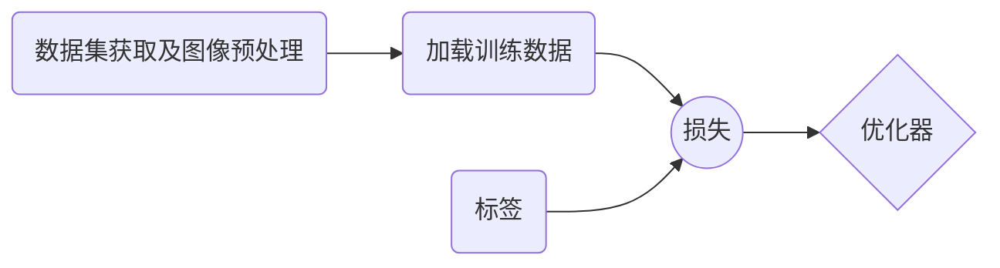

# 1、architecture
## 1.1 特征提取网络
&emsp;&emsp;这是从[SiamFC论文](https://arxiv.org/pdf/1606.09549.pdf)截取的框架图

&emsp;&emsp;上图中，孪生网络结构中$\varphi$ 代表的是特征提取网络，$\ast$代表互相关运算，上分支对应127x127x3大小的目标模板图像，下分支对应255x255x3大小的搜索图像，上下分支共享网络参数。这里给大家介绍的是带批量规范化(Batch Normation)的Alexnet版本，代码如下：

```python
class AlexNet(nn.Module):
    output_stride = 8
    def __init__(self,init_weight=True):
        super(AlexNet, self).__init__()
        self.conv1 = nn.Sequential(
            nn.Conv2d(3, 96, 11, 2),    #[1,3,127,127]->[1,96,59,59]
            nn.BatchNorm2d(96),
            nn.ReLU(inplace=True),
            nn.MaxPool2d(3, 2))         #[1,96,59,59]->[1,96,29,29]
        self.conv2 = nn.Sequential(
            nn.Conv2d(96, 256, 5, 1),   #[1,96,29,29]->[1,256,25,25]
            nn.BatchNorm2d(256),
            nn.ReLU(inplace=True),
            nn.MaxPool2d(3, 2))         #[1,256,25,25]->[1,256,12,12]
        self.conv3 = nn.Sequential(
            nn.Conv2d(256, 384, 3, 1),  #[1,256,12,12]->[1,384,10,10]
            nn.BatchNorm2d(384),
            nn.ReLU(inplace=True))
        self.conv4 = nn.Sequential(
            nn.Conv2d(384, 384, 3, 1),  #[1,384,10,10]->[1,384,8,8]
            nn.BatchNorm2d(384),
            nn.ReLU(inplace=True))
        self.conv5 = nn.Sequential(
            nn.Conv2d(384, 128, 3, 1))   #[1,384,8,8]->[1,128,6,6]
        #初始化网络参数
        if init_weight:
            self._init_weights()

    def forward(self, x):
        x = self.conv1(x)
        x = self.conv2(x)
        x = self.conv3(x)
        x = self.conv4(x)
        x = self.conv5(x)
        return x
	#初始化网络参数
    def _init_weights(self):
        for m in self.modules():
            if isinstance(m, nn.Conv2d):
                nn.init.xavier_uniform_(m.weight, 1) #xavier是参数初始化，它的初始化思想是保持输入和输出方差一致，这样就避免了所有输出值都趋向于0
                if m.bias is not None:
                    nn.init.constant_(m.bias, 0)     #偏置初始化为0
            elif isinstance(m, nn.BatchNorm2d):      #在激活函数之前，希望输出值由较好的分布，以便于计算梯度和更新参数，这时用到BatchNorm2d函数
                nn.init.constant_(m.weight, 1)
                nn.init.constant_(m.bias, 0)
            elif isinstance(m, nn.Linear):
                nn.init.xavier_uniform_(m.weight, 1)
                if m.bias is not None:
                    nn.init.constant_(m.bias, 0)
```
如代码所示，首先简单分析几个函数功能：

1. `nn.Conv2d:`重点关注前5个参数，in_channels、out_channels、kernel_size、stride和padding(默认为1和0)，假设输入feature map大小为$f$x$f$,则输出feature map的大小是:$$ \lfloor\frac{f-kernel_{size}+2*padding}{stride}+1\quad\rfloor$$式中，$\lfloor\rfloor$表示下取整。
2. `nn.BatchNorm2d:`防止梯度爆炸和梯度消失，加快网络学习，输入参数为上一层通道数。
3. `nn.ReLu:`对每一层的输出激活处理，增加网络的非线性学习能力。
4. `nn.Maxpool2d:`池化下采样，代码中一共有三次下采样(kernel_size=3,stride=2)，每次缩小1/2特征图大小。

&emsp;&emsp;代码注释仅以上分支为例，根据上式进行推导举例[1,3,127,127]->[1,96,59,59]->[1,96,29,29]来说，卷积层的in_channels=3，out_channels=96，kernel_size=11，stride=2，padding=0(默认)，输入图片大小是127x127，那么输出feature map大小为59=(127-11+2 $\cdot$ 0)/2+1；池化层的kernel_size=3,stride=2，(59-3+2 $\cdot$ 0)/2+1。依次类推，可以得到最终输入互相关层的feature map大小为[1,128,6,6]，同样地，下分支得到的feature map的大小是[1,128,22,22]。
&emsp;&emsp;**另外有两点需要注意**：因为网络的输入要求是4维，第1维指的是batch_size，比如训练过程中batch_size为(8,16,32等等)，代码中假设为1； total_stride=8表示下采样的总步距，代码一共出现3次Maxpool2d，2^3=8，这个参数在后面测试阶段代码分析会详细讲解。
为了验证网络的可行性，验证代码如下：

```python
if __name__ == '__main__':
    model = AlexNet()
    z = torch.randn([1, 3, 127, 127])
    feature_map_z = model(z)
```
feature_map_z得shape如下：

## 1.2 互相关层
&emsp;&emsp;原始图像对通过特征提取网络后，得到相应大小的feature map进行互相关运算，即把目标模板的feature map[1,128,6,6]作为卷积核，搜索图像的feature map[1,128,22,22]作为输入，卷积核在搜索图像的feature map上密集地采集子窗口进行相似性的判断，6x6大小的卷积核在22x22特征图上滑动得17x17大小的response map，得分最高的子窗口(对应17x17特征图上的像素点)即为预测目标所在位置。代码如下：
```python
class _corr(nn.Module):
    def __init__(self):
        super(_corr, self).__init__()
    #互相关运算，设batch_size=8
    def forward(self, z, x):
        kernel = z #[8,128,6,6]
        group = z.size(0)  #8
        input = x.view(-1, group*x.size(1), x.size(2), x.size(3))
        #输出为[8,1,17,17], 那么反推input[8,128,22,22]，kernel[1,1024,6,6] group=128/1024？错误
        #所以先输出[1,8,17,17],再view变换维度成[8,1,17,17],那么input[1,1024,22,22],kernel[8,128,6,6],group=1024/128=8=batch_size
        response_maps = F.conv2d(input, kernel,groups=group)
        response_maps = response_maps.view(x.size(0),-1,response_maps.size(2), response_maps.size(3))
        return response_maps
```
下面是对代码中函数`F.conv2d`和 `view`的讲解
1. `F.conv2d:`输入input(batch_size,in_channels,h,w)，卷积核kernel(out_channels,in_channels/groups,kh,kw)；输入batch_size对图片，要得到batch_size个相同大小的response map，即大小为(batch_size,out_channels=1,17,17)的response map。
2.  `view:`转换tensor张量的大小，-1表示自动填充，保证tensor元素个数不变；另外，view与reshape不同，view函数只能用于内存中连续存储的tensor，而reshape则没有这个限制条件。

同样，我们对代码进行验证，**z的第一维取8或1结果都一样**，8代表8个卷积核分别与对应的某个特征图卷积操作，1代表用1个卷积核对每个特征图卷积操作，**这两种情况分别对应训练和测试**。

```python
if __name__ == '__main__':
	z = torch.randn([8, 128, 6, 6])
    # z = torch.randn([1,128,6,6])
    x = torch.randn([8, 128, 22, 22])
    f = _corr()
    response_maps = f(z, x)
```
response_maps的shape如下：

&emsp;&emsp;至此，完成了对网络框架**architecture**的代码分析!!!接下来是训练和测试代码的分析。
# 2、training
&emsp;&emsp;根据我在阅读作者源代码后的理解结合自己的思路，给出训练的框图如下。训练过程中，首先要获取训练数据集的所有视频序列(每个视频序列的所有帧)，我采用的是[GOT-10k](http://got-10k.aitestunion.com/index)数据集训练；获取数据集之后进行图像预处理，对每一个视频序列抽取两帧图像并作数据增强处理(包括裁剪、resize等过程)，分别作为目标模板图像和搜索图像；把经过图像处理的所有图像对加载并以batch_size输入网络得到预测输出；建立标签和损失函数，损失函数的输入是预测输出，目标是标签；设置优化策略，梯度下降损失，最终得到网络模型。



## 2.1 图像预处理
&emsp;&emsp;先贴代码，再分析：

```python
def train(data_dir, net_path=None,save_dir='pretrained'):
    #从文件中读取图像数据集
    seq_dataset = GOT10k(data_dir,subset='train',return_meta=False)
    #定义图像预处理方法
    transforms = SiamFCTransforms(  
        exemplar_sz=cfg.exemplar_sz, #127
        instance_sz=cfg.instance_sz, #255
        context=cfg.context) #0.5
    #从读取的数据集每个视频序列配对训练图像并进行预处理，裁剪等
    train_dataset = GOT10kDataset(seq_dataset,transforms)
```
data_dir是存放GOT-10k数据集的文件路径，GOT-10k一共有9335个训练视频序列，seq_dataset返回的是所有视频序列的图片路径列表seq_dirs及对应groundtruth列表anno_files及一些其他信息，如下：

&emsp;&emsp;接下来是定义好图像预处理方法，在GOT10kDataset方法中对每个视频序列配对两帧图像，并使用定义好的图像处理方法，接下来直接进入该方法分析代码，GOT10kDataset的代码结构如下图：

```python
class GOT10kDataset(Dataset): #继承了torch.utils.data的Dataset类
    def __init__(self, seqs, transforms=None,pairs_per_seq=1):
    def __getitem__(self, index): #通过_sample_pair方法得到索引返回item=(z,x,box_z,box_x),然后经过transforms处理
    def __len__(self): #返回9335*pairs_per_seq对
    def _sample_pair(self, indices): #随机挑选两个索引，这里取的间隔不超过T=100
    def _filter(self, img0, anno, vis_ratios=None): #通过该函数筛选符合条件的有效索引val_indices
```

这里最重要的方法就是__**getitem**__，该方法最终返回处理后的图像，在内部首先调用了_sample_pair方法，用于提取两帧有效图片(有效的定义是图片目标的面积和高宽等有约束条件)的索引，在得到这两帧图片和对应groundtruth之后通过定义好的transforms进行处理，transforms是SiamFCTransforms类的实例化对象，该类中主要继承了resize图片大小和各种裁剪方式等，如代码所示：

```python
class SiamFCTransforms(object):
    def __init__(self, exemplar_sz=127, instance_sz=255, context=0.5):
        self.exemplar_sz = exemplar_sz
        self.instance_sz = instance_sz
        self.context = context
        #transforms_z/x是数据增强方法
        self.transforms_z = Compose([
            RandomStretch(),     #随机resize图片大小,变化再[1 1.05]之内
            CenterCrop(instance_sz - 8),  #中心裁剪 裁剪为255-8
            RandomCrop(instance_sz - 2 * 8),   #随机裁剪  255-8->255-8-8
            CenterCrop(exemplar_sz),   #中心裁剪 255-8-8->127
            ToTensor()])                        #图片的数据格式从numpy转换成torch张量形式
        self.transforms_x = Compose([
            RandomStretch(),                   #s随机resize图片
            CenterCrop(instance_sz - 8),      #中心裁剪 裁剪为255-8
            RandomCrop(instance_sz - 2 * 8),  #随机裁剪 255-8->255-8-8
            ToTensor()])                      #图片数据格式转化为torch张量
    
    def __call__(self, z, x, box_z, box_x): #z，x表示传进来的图像
        z = self._crop(z, box_z, self.instance_sz)       #对z(x类似)图像 1、box转换(l,t,w,h)->(y,x,h,w)，并且数据格式转为float32,得到center[y,x],和target_sz[h,w]
        x = self._crop(x, box_x, self.instance_sz)       #2、得到size=((h+(h+w)/2)*(w+(h+2)/2))^0.5*255(instance_sz)/127
        z = self.transforms_z(z)                         #3、进入crop_and_resize:传入z作为图片img，center，size，outsize=255(instance_sz),随机选方式填充，均值填充
        x = self.transforms_x(x)                         #   以center为中心裁剪一块边长为size大小的正方形框(注意裁剪时的padd边框填充问题)，再resize成out_size=255(instance_sz)
        return z, x
```
实例化对象后，直接从__call__开始运行代码，首先关注的应该是_crop函数，该函数将原始的两帧图片分别以目标为中心，裁剪一块包含上下文信息的patch，patch的边长定义如下：$$patch_{size}=0.5*\sqrt{(h+(w+h)/2)\cdot(w+(w+h)/2)}*255/127$$式中，w、h分别表示目标的宽和高。在裁剪过程中会出现**越界**的情况，需要对原始图像边缘填充，填充值固定为图像的RGB均值，填充大小根据图像边缘越界最大值作为填充值，具体实现过程由以下代码完成。

```python
# padding操作
	#corners表示目标的[ymin,xmin,ymax,xmax]
    pads = np.concatenate((
        -corners[:2], corners[2:] - img.shape[:2]))
    npad = max(0, int(pads.max())) #得到上下左右4个越界值中最大的与0对比，<0代表无越界
    if npad > 0:
        img = cv2.copyMakeBorder(
            img, npad, npad, npad, npad,
            cv2.BORDER_CONSTANT, value=img_average)
```

裁剪完成后resize成255x255x3大小的图片，然后就是一系列的裁剪过程作为数据增强，将其中一帧图像裁剪成127x127x3大小作为目标模板图像，然而，对搜索图像进行裁剪最终得到的大小为239，并不是255，所以在训练过程中，得到的搜索图像feature map大小是[128,20,20]，response map大小[15,15]，但这并不会造成训练的模型对测试产生影响。
&emsp;&emsp;同样，用代码验证了图像预处理的效果，图片展示了目标模板图像z的获取流程。

```python
if __name__ == "__main__":
    root_dir = 'D:/Dataset/GOT-10k'
    seq_dataset = GOT10k(root_dir, subset='train')
    transforms = SiamFCTransforms(
        exemplar_sz=cfg.exemplar_sz,  # 127
        instance_sz=cfg.instance_sz,  # 255
        context=cfg.context)  # 0.5
    train_dataset = GOT10kDataset(seq_dataset, transforms)
    train_dataset.__getitem__(1) #返回随机的某个视频序列两帧处理后的图片
```


## 2.2 加载训练数据、标签及损失函数
&emsp;&emsp;图像预处理完成后，得到了用与训练的9335对图像，将图像加载批量加载输入网络得到输出结果作为损失函数的input，损失函数的target是制定好的labels。

```python
#加载训练数据集
    loader_dataset = DataLoader( dataset = train_dataset,
                                 batch_size=cfg.batch_size,
                                 shuffle=True,
                                 num_workers=cfg.num_workers,
                                 pin_memory=True,
                                 drop_last=True, )
    #初始化训练网络
    cuda = torch.cuda.is_available()  #支持GPU为True
    device = torch.device('cuda:0' if cuda else 'cpu')  #cuda设备号为0
    model = AlexNet(init_weight=True)
    corr = _corr()
    model = model.to(device)
    corr = corr.to(device)
    # 设置损失函数和标签
    logist_loss = BalancedLoss()
    labels = _create_labels(size=[cfg.batch_size, 1, cfg.response_sz - 2, cfg.response_sz - 2])
    labels = torch.from_numpy(labels).to(device).float()
```
首先根据自己设备情况设定好batch_size和num_workers情况，windows下num_workers只能设置为0，然后加载网络并初始化网络参数。本小节主要讲网络输出的labels和损失函数，接下来只是我个人的一些理解，**代码与论文理论部分形式不一致，但效果一样**。先上图，论文中labels以及损失函数如下图：

然而代码中的labels值却是1和0，损失函数使用的是二值交叉熵损失函数`F.binary_cross_entropy_with_logits`，如下图推导所示，解释了为什么代码实现部分真正使用的labels值是1和0，而理论部分使用的是1和-1。


lables公式中，在response map距离中心距离小于R/k值得设为1，其他设为0，R值对应原图的以中心为原点的半径，k是total_stride，R/k映射为response map上以中心为原点的半径，利用下面代码的这个_creat_labels方法可以得到标签。

```python
def _create_labels(size):
    def logistic_labels(x, y, r_pos):
        # x^2+y^2<4 的位置设为为1，其他为0
        dist = np.sqrt(x ** 2 + y ** 2)
        labels = np.where(dist <= r_pos,    #r_os=2
                          np.ones_like(x),  #np.ones_like(x),用1填充x
                          np.zeros_like(x)) #np.zeros_like(x),用0填充x
        return labels
    #获取标签的参数
    n, c, h, w = size  # [8,1,15,15]
    x = np.arange(w) - (w - 1) / 2  #x=[-7 -6 ....0....6 7]
    y = np.arange(h) - (h - 1) / 2  #y=[-7 -6 ....0....6 7]
    x, y = np.meshgrid(x, y)       
    #建立标签
    r_pos = cfg.r_pos / cfg.total_stride  # 16/8
    labels = logistic_labels(x, y, r_pos)
    #重复batch_size个label，因为网络输出是batch_size张response map
    labels = labels.reshape((1, 1, h, w))   #[1,1,15,15]
    labels = np.tile(labels, (n, c, 1, 1))  #将labels扩展[8,1,15,15]
    return labels
```
验证结果如下图，只截取了部分labels，得到的labels对应输入，大小都是[8,1,15,15]

```python
if __name__ == '__main__':
    labels = _create_labels([8,1,15,15])  #返回的label.shape=(8,1,15,15)
```


## 2.3 优化策略
&emsp;&emsp;代码选择的优化器是加入**一阶动量**的SGD，什么是一阶动量？一阶动量的数学概念是指数加权平均和，可以简单理解为在更新网络参数时保留了一部分前一次参数更新的方向作为缓冲，简而言之就是可以通过积累之前的动量来加速当前梯度下降。原始的SGD更新参数可以用下式表示，$\theta$表示网络参数，$lr$表示学习率，$d_\theta(Loss)_{now}$表示损失函数对参数的求导。$$v_{now}=lr*d_\theta(Loss)_{now}$$$$\theta=\theta-v_{now}$$使用一阶动量的SGD，仅仅是对$v$进行优化，$v_{now}=momentum*v_{last}+(1-momentum)*lr*d_\theta(Loss)_{now}$。另外，二阶动量是在学习率$lr$上进行内部优化，代码没有使用二阶动量，但是采用了类似二阶动量的方式人工对$lr$进行优化，学习率$lr$随着训练次数epoch增多而减小，具体值如下公式
$$lr=initial_{lr}*gamma^{epoch}$$式中，$initial_{lr}$是初始学习率，$gamma$是定义的超参，$epoch$为训练次数。整个优化器及学习率调整实现代码如下：

```python
#建立优化器，设置指数变化的学习率
    optimizer = optim.SGD(
        model.parameters(),
        lr=cfg.initial_lr,              #初始化的学习率，后续会不断更新
        weight_decay=cfg.weight_decay,  #λ=5e-4，正则化
        momentum=cfg.momentum)          #v(now)=dx∗lr+v(last)∗momemtum
    gamma = np.power(                   #np.power(a,b) 返回a^b
        cfg.ultimate_lr / cfg.initial_lr,
        1.0 / cfg.epoch_num)
    lr_scheduler = ExponentialLR(optimizer, gamma)  #指数形式衰减，lr=initial_lr*(gamma^epoch)
```

## 2.4 模型的训练与保存
&emsp;&emsp;一切准备工作就绪后，就开始训练了。代码中设定epoch_num为50次，训练时密切加上**model.train()**，告诉网络处于训练状态，这样，网络运行时就会利用pytorch的自动求导机制求导；在测试时，改为**model.eval()**，关闭自动求导。模型训练的步骤如代码所示：

```python
    for epoch in range(start_epoch, cfg.epoch_num+1):
        model.train()
        #遍历训练集
        for it, batch in enumerate(tqdm(loader_dataset)):
            z = batch[0].to(device,non_blocking=cuda)   # z.shape=([8,3,127,127])
            x = batch[1].to(device, non_blocking=cuda)  # x.shape=([8,3,239,239])
            #输入网络后通过损失函数
            z, x = model(z), model(x)
            responses = corr(z, x) * cfg.out_reduce  # 返回的是heatmap的响应表15x15  因为x是239x239 [8,1,15,15]
            loss = logist_loss(responses, labels)
            #反向传播
            optimizer.zero_grad() #梯度清0
            loss.backward()       #反向传播求导
            optimizer.step()	  #更新参数
```
代码中cfg.out_reduce取0.001，将网络输出缩小1000倍，再与labels值0、1通过损失函数进行梯度下降，倘若缺少这一步，输出将非常大，也就意味这损失函数的input与target相差巨大，这将发生梯度爆炸。下图是乘0.001前后的Loss值情况：
优化过程的重点是反向传播三步，顺序不能乱，首先对之前的梯度清0，再损失反向传播，最后更新网络参数。如果不对梯度清0，刚开始时，累加的梯度可以加速网络训练，但随着训练次数的增长梯度不断累加会造成梯度爆炸。
&emsp;&emsp;最后，要保存训练好的模型进行测试，在保存中，代码不仅仅保存model的参数，并且保留了epoch和optimizer的参数，方便训练中断时，可以使用上次训练好的模型接着训练，把此刻的epoch和optimizer的学习率等参数一同保存，保存路径为save_path。

```python
torch.save({'epoch':epoch,
            'model':model.state_dict(),
            'optimizer':optimizer.state_dict()},save_path)
```
同时，附上模型再次训练的代码：

```python
    if net_path is not None:
        checkpoint = torch.load(net_path)
        if 'epoch' in checkpoint:
            start_epoch = checkpoint['epoch'] + 1
            model.load_state_dict(checkpoint['model'])
            optimizer.load_state_dict(checkpoint['optimizer'])
```
只需要在调用train()函数时传入模型的net_path参数就可以接着训练。
&emsp;&emsp;**training**部分的代码分析也告一段落！
# 3、test
&emsp;&emsp;测试时，可以使用多种数据集，[GOT-10k-toolkit](https://github.com/got-10k/toolkit)提供了多种数据集接口，测试的方法都千篇一律，只要自己提供init和update方法便可在数据集上进行测试与性能评估，使用过程中，需要好好理解接口源码，包括测试方式和性能评估方式。在后面，我会给出代码在otb100、otb2013和GOT10k测试集上的性能结果。
## 3.1 init(初始帧)
&emsp;&emsp;这一步目的是要得到6x6x128的目标模板feature map，在后续跟踪过程中，一直使用它作为卷积核不变，这也是一大SiamFC的缺点所在；init内还要初始化目标的中心所在位置、宽高、汉宁窗等后续跟踪使用。
```python
#传入第一帧的gt和图片，初始化一些参数，计算一些之后搜索区域的中心等等
    def init(self, img, box):
        #设置成评估模式，测试模型时一开始要加这个，属于Pytorch，训练模型前，要加self.net.train()
        self.model.eval()
        #将原始的目标位置表示[l,t,w,h]->[center_y,center_x,h,w]
        yxhw = ltwh_to_yxhw(ltwh=box)
        self.center, self.target_sz = yxhw[:2], yxhw[2:]
        #创建汉宁窗口update使用
        self.response_upsz = cfg.response_up * cfg.response_sz  # 16*17=272
        self.hann_window = creat_hanning_window(size=self.response_upsz)
        #三种尺度1.0375**(-1,0,1) 三种尺度
        self.scale_factors = three_scales()
        # patch边长,两种边长：目标模板图像z_sz和搜索图像x_zs
        context = cfg.context * np.sum(self.target_sz)  # 上下文信息(h+w)/2
        self.z_sz = np.sqrt(np.prod(self.target_sz + context))  # (h+(h+w)/2)*(w+(h+2)/2))^0.5
        self.x_sz = self.z_sz * cfg.instance_sz / cfg.exemplar_sz  # (h+(h+w)/2)*(w+(h+2)/2))^0.5*255/127
        #图像的RGB均值，返回(aveR,aveG,aveB)
        self.avg_color = np.mean(img, axis=(0, 1))
        #裁剪一块以目标为中心，边长为z_sz大小的patch,然后将其resize成exemplar_sz的大小
        z = z_to127(img, self.center, self.z_sz, cfg.exemplar_sz, self.avg_color)
        z = torch.from_numpy(z).to(    #torch.size=([1,3,127,127])
            self.device).permute(2, 0, 1).unsqueeze(0).float()
        self.kernel = self.model(z)    #torch.size=([1,128,6,6])
```
follow代码，先设置**model.eval()**，原因在training过程中讲了，初始化目标的位置信息self.center和self.target_sz分别代表目标的中心位置和高宽；接着是汉宁窗口和尺度因子，汉宁窗口如下图展示的是17x17大小的，它与response map相乘会突出response map的中心并抑制边缘。窗口大小是17*16=272，而不是response map的大小17，这样做的好处是找到更加精确的位置，相比于在17x17大小的特征图上寻找最大值，272x272大小的特征图分辨率更高，位置更精确，所以在后续跟踪过程中，得到的17x17大小的response map会resize成272x272大小；代码使用的是SiamFC_3s，所以定义了三个不同的尺度；包含上下文信息的patch边长与training不同，训练时是将两张图片以相同的patch裁剪再resize成255x255x3大小，之后在一系列数据增强的过程中将其中一张图片裁剪成127x127x3作为目标模板图像。而test过程中，目标模板图像和搜索图像的patch边长不同，如代码所示，成比例255/127关系；最后就是对init传入的初始帧图片裁剪并输入网络得到跟踪过程使用的卷积核，大小为[1,128,6,6]。

## 3.2 update(后续帧)
&emsp;&emsp;Update就是tracking过程，传入的参数是后续帧图片，一共可以分为三个阶段：1、经过网络的正向推导得到response map；2、根据response map的最大值反推目标在原始图片中的位置；3、参数更新。本文只讲前两个阶段，参数更新就是在得到新的目标后，更新目标的位置信息和高宽，高宽的更新依据尺度。

```python
 #传入后续帧，然后根据SiamFC跟踪流程返回目标的box坐标
    def update(self, img):
        self.model.eval()
        """----------------正向推导得到response map最大值位置---------------------"""
        #三种patch边长 patch*3scales
        x = x_to3s255(img,self.center,self.x_sz,self.scale_factors,cfg.instance_sz,self.avg_color)
        #numpy转为float的torch型张量
        x = torch.from_numpy(x).to(self.device).permute(0, 3, 1, 2).float()
        #[3,255,22,22]
        x = self.model(x)
        #得到三种尺度下的response map
        responses = self.corr(self.kernel, x) * cfg.out_reduce #[3，1，17，17]
        responses = responses.squeeze(1).cpu().numpy()   #压缩为[3，17，17]并转为numpy作后续计算处理
        #将17x17大小的response map->[3,272,272]
        responses = map_to272(responses,out_size=self.response_upsz)
        #对尺度变化做出相应惩罚
        responses[:cfg.scale_num // 2] *= cfg.scale_penalty      #response[0]*（0.9745惩罚项）
        responses[cfg.scale_num // 2 + 1:] *= cfg.scale_penalty  #response[2]*（0.9745惩罚项）
        #找到最大值属于哪个response map，并把该response map赋给response
        scale_id = np.argmax(np.amax(responses, axis=(1, 2))) #里面求得三个map的最大值 再对三个值求最大值 得到索引
        response = responses[scale_id]   #[272，272]
        #一系列数据处理，重点在汉宁窗惩罚
        response = map_process(response,self.hann_window)
        loc = np.unravel_index(response.argmax(),response.shape)   #unravel_index该函数可返回索引response.argmax()的元素的坐标，逐行拉伸，返回第几行第几个
        """---------------由response map最大值位置反推目标在原图像的位置------------"""
        disp_in_response = np.array(loc) - (self.response_upsz - 1) / 2  #峰值点相对于response中心的位移
        disp = disp_in_response / 16
        disp = disp * 8
        disp = disp * self.x_sz * self.scale_factors[scale_id] / cfg.instance_sz
        self.center += disp
        """---------------参数更新------------"""
```
### 正向推导得到response map最大值位置
&emsp;&emsp;代码中可知，三种尺度的具体含义是三种不同patch。在对目标的跟踪过程中，目标的形状大小是会发生变化的，如果不更新目标的大小(h、w)，跟踪器的性能将很糟糕，又由于理论上，相邻视频帧的目标形状变化极小，所以使用的不同尺度也都接近于1.0375^(-1,0,1)。通过三种patch得到三张255x255x3大小的图片输入model，再与init的卷积核互相关，得到3张response map，每张map代表一个尺度，并且对第1、3张尺度变化的response map**惩罚**。惩罚可以理解为置信度因子，首先明确要加入多种不同尺度，假设没有惩罚项，目标存在形状变化效果还好，但当目标形状不发生变化时，会造成极大的干扰；如果加了惩罚项，当目标形状不发生变化时，会对尺度变化的response map乘小于1的数，减小它的值，使得response map的最大值存在尺度为1的response map上，当目标形状变化时，由于我们乘的数较小，如果目标形状确实变化，还是会在尺度变化的response map上得到最大值。简而言之，加入惩罚项后，目标变化时，我们更加相信目标变化了，而排出目标轻微的抖动等(不属于形状变化)。
&emsp;&emsp;选出了response map之后，接下来要得到该response map中最大值的位置。这里，就需要对这张response map加窗处理，代码使用的是汉宁窗，余弦窗的效果几乎一样。为什么要加窗呢？也可以理解为一种置信度，置信的对象是目标发生了大位移，因为在相邻帧中，目标的位置变化较小，所以加窗可以有效抑制跟踪器因为干扰而产生漂移，使跟踪器更加稳定。下图是对response map加窗前后的对比图，可以看出，对response map加窗处理后，能够更加突出目标位置，虽然效果不是很明显。

&emsp;&emsp;在完成上面两步之后，就得到了最大值的索引loc
### 由response map最大值位置反推目标在原图像的中心位置
&emsp;&emsp;接下来是重点！！下分支的推导过程：

首先我们由上一步loc计算得到其相对于272x272response map中心点的位移disp_in_response，接下来一步步反推相对(17x17response map、特征图、搜索图像、原始image)中心点的位移。
1. response map17x17：disp=disp_in_response/16，resize直接/就行。
2. 特征图：disp=disp，位移相同，互相关(卷积)过程中没有加入padding所以22->17。
3. 搜索图像：disp=disp*8，表面上，255/22不等于8，但这与resize不同，网络一系列卷积的总步距total_stride为8，只不过没有padding操作，与上相同。论文也提到过，由于网络没有padding操作，使得网络不满足全卷积性质，所以才会有255->22而不是255->255/8，不过no padding也是SiamFC的一大优势，只有no padding网络才满足空间平移不变性，padding操作会导致训练的时候出现位置偏差。
4. 原始image：disp=disp*pach_size/255，首先在原始image上裁剪patch并不会引起disp位移发生变化，因为裁剪仅仅是从原始image以中心取一块，图像的分辨率并没有变化。而resize过程是将边长为patch_size的图像resize成255x255x3的搜索图像，倍率变化为255/patch_size，所以disp等于disp乘上patch_size/255。

经过上述过程就得到了目标在原始image中相对于中心的位移，这里的中心指得是上一帧的目标中心，是已知量，也是每次update需要更新的。
&emsp;&emsp;至此，SiamFC代码分析over！
## 3.3 otb、GOT10k结果
&emsp;&emsp;模型上传在github中，使用GOT10k测试集时，需要将跑出的results提交给[here](http://got-10k.aitestunion.com/submit_instructions)才能查看结果，下面还给出看官方的测试结果，otb结果比源代码提供者的更高。


